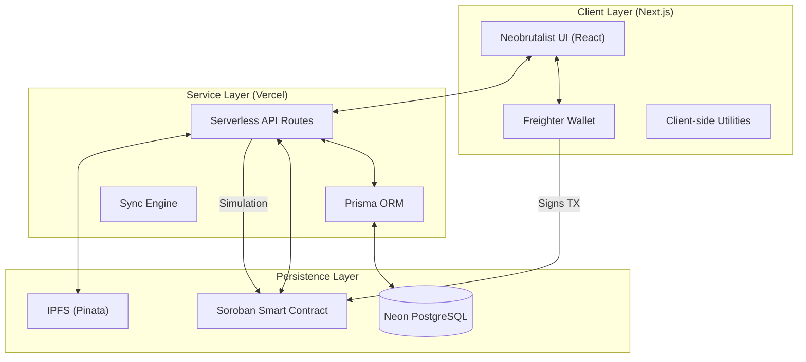

# 🏗️ Technical Architecture: BookLibrary Stellar

This document outlines the system architecture, design decisions, and data flow for the BookLibrary Stellar dApp.

## 🔗 System Overview

BookLibrary Stellar is a hybrid decentralized application (dApp) that bridges traditional web performance with blockchain-backed immutable provenance.

---

## 🛠️ Technology Stack

| Layer | Technology | Rationale |
|-------|------------|-----------|
| **Core Framework** | Next.js 14 (App Router) | SEO-optimized, blazing fast serverless execution. |
| **Blockchain** | Stellar Soroban (Rust SDK) | High-throughput, low-fee smart contracts. |
| **Database** | Neon PostgreSQL (Serverless) | Instant scale-to-zero metadata caching. |
| **ORM** | Prisma | Type-safe database management and ease of migration. |
| **Storage** | Pinata (IPFS) | Immutable decentralized asset storage for book files. |
| **Styling** | Vanilla CSS + Framer Motion | High-performance neobrutalist animations. |
| **Identity** | Freighter SDK | The official and most secure Stellar wallet standard. |

---

## 🛡️ Smart Contract Design

The `BookLibrary` contract follows a **State-Machine Pattern** for book management:

1.  **Initialization**: Admin sets a deposit requirements and links the contract to a specific Stellar Asset Contract (SAC).
2.  **Registration**: `add_book` stores the cryptographic content hash (IPFS) and metadata mappings on-chain.
3.  **Borrowing Cycle**: 
    *   **Escrow**: Users deposit tokens to the contract.
    *   **Staking**: Tokens are locked until the book is returned.
    *   **Verification**: Events are emitted (`book_brw`, `book_ret`) for frontend synchronization.

---

## ⚡ Sync Engine Logic

To solve the "Blockchain Connectivity" challenge, we implemented a **Reactive Deep Sync Engine**:

*   **Server-side Simulation**: Uses `simulateReadOnly` on Soroban to fetch the global book count without gas fees.
*   **Parallel Fetching**: We use a concurrent batch processor (`Promise.all`) to reconcile 20+ on-chain records simultaneously with our local database.
*   **Normalization**: Title and Author metadata are normalized (case-insensitive, trimmed) to ensure perfect matching between off-chain cache and on-chain truth.

---

## 🔒 Security Measures

*   **Simulation Guards**: All transactions are simulated on the backend before being presented to the wallet for signing.
*   **Rate Limiting**: API routes are optimized for Vercel's edge cache to prevent RPC spam.
*   **Environment Isolation**: Sensitive keys (`STELLAR_SECRET_KEY`) are stored in Vercel's secure environment manager, never exposed to the frontend.
