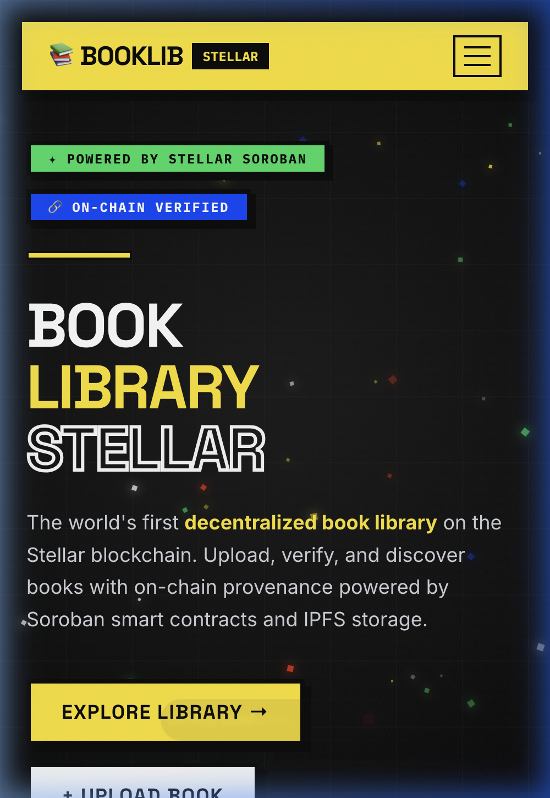
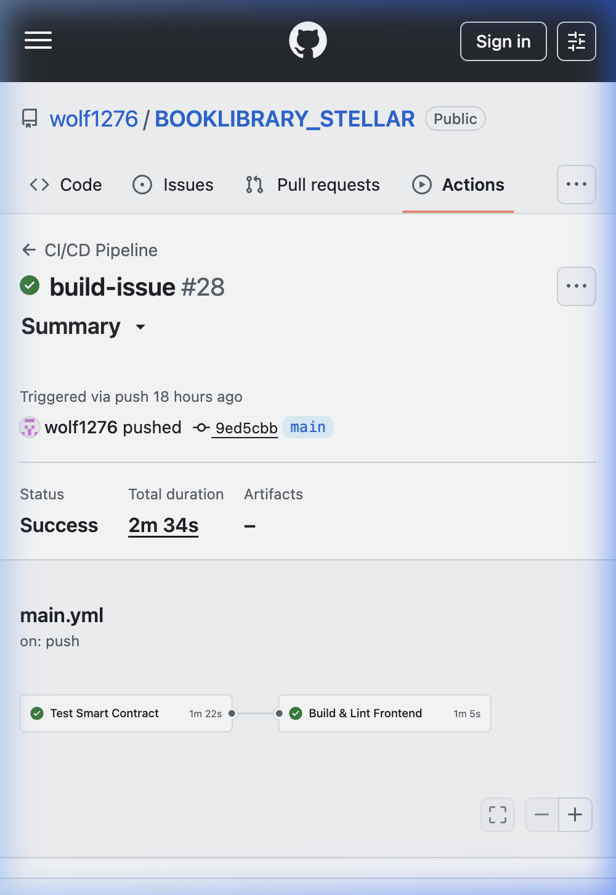
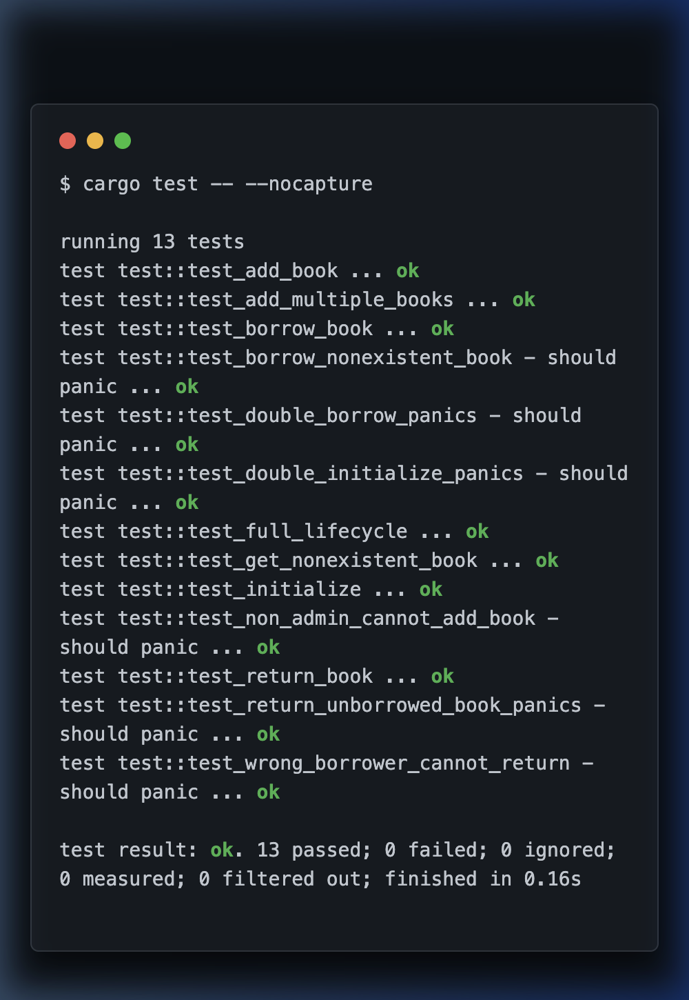

# 📚 BookLibrary Stellar


**A decentralized, on-chain library management system built on Stellar Soroban.** Register, borrow, and manage books with blockchain-backed security and immutable records, fully optimized for serverless performance on Vercel.

### 🚀 [Live Global dApp](https://booklibrary-stellar.vercel.app) | 🎬 [Watch Full Walkthrough](#-application-walkthrough)

---

## 🎬 Application Walkthrough

<div align="center">
  
  <p><i>Real-time blockchain synchronization, on-chain registration, and neobrutalist UI verification.</i></p>
</div>

---

## 📸 Showcase & Verification

<div align="center">
  <table border="0">
    <tr>
      <td align="center"><b>Mobile Experience</b></td>
      <td align="center"><b>CI/CD Pipeline</b></td>
    </tr>
    <tr>
      <td></td>
      <td></td>
    </tr>
    <tr>
      <td align="center" colspan="2"><b>Soroban Contract Tests (13 Passed)</b></td>
    </tr>
    <tr>
      <td align="center" colspan="2"></td>
    </tr>
  </table>
</div>

---

## ✨ Core Features

- **📖 On-Chain Registration** — Metadata and IPFS content hashes are permanently anchored to the Stellar ledger.
- **🔐 Wallet-First Identity** — Secure authentication and signing via the **Freighter** wallet.
- **⛓️ Trustless Borrowing** — Smart contract-enforced borrowing logic with automatic status tracking.
- **⚡ Serverless Architecture** — Blazing fast API interactions via Vercel Edge-optimized functions.
- **🎨 Brutalist Aesthetics** — A high-contrast, animated interface built with **Three.js** and **Framer Motion**.
- **💾 Hybrid Storage** — Metadata in Neon Postgres for speed, and on-chain Soroban storage for truth.

---

## 🏗️ Technical Architecture

This project is now a **unified monorepo** where the frontend and backend live together as a single Next.js application, making deployment effortless.

| Layer | Technology | Role |
|-------|-----------|------|
| **Primary** | `frontend/` | Next.js 14 Web Application & API Routes |
| **Logic** | `contracts/` | Rust-based Soroban Smart Contract |
| **DB** | Prisma + Neon | Metadata caching & user-facing library data |
| **Auth** | Freighter Wallet | Transaction signing and identity |

### 📁 Directory Map

```text
.
├── contracts/               # 🛡️ Smart Contract (Soroban/Rust)
│   └── book-library/        # Core business logic for on-chain books
├── frontend/                # 🌐 Unified Web App & API (Next.js)
│   ├── src/app/api/         # ⚡ Serverless API routes (formerly Express backend)
│   ├── src/lib/             # 🛠️ Shared SDK utilities & Prisma singleton
│   ├── src/utils/           # 🔌 Client-side blockchain helpers
│   └── prisma/              # 🗄️ Database schema definitions
└── MIGRATION_SUMMARY.md     # 📝 Technical details of the Vercel migration
```

---

## 🚀 One-Click Quick Start

### 1. Prerequisites
- [Freighter Wallet](https://www.freighter.app/) (Network: Testnet)
- Node.js 18+
- [Soroban CLI](https://soroban.stellar.org/docs/getting-started/setup)

### 2. Implementation
```bash
# Register & install
git clone https://github.com/wolf1276/BOOKLIBRARY_STELLAR.git
cd BOOKLIBRARY_STELLAR/frontend
npm install

# Setup Database & Contract
npx prisma generate
cp .env.local.example .env.local
# Add your DATABASE_URL, STELLAR_SECRET_KEY, and CONTRACT_ID to .env.local
```

### 3. Launch
```bash
npm run dev
```
Visit `http://localhost:3000` to interact with your local environment.

---

## 📦 Smart Contract Specifications

Current contract deployed on **Stellar Testnet**:
`CBYNK3NUXBOEWLQQHACBMTH7JLHV4PSNJ22VPSHK77MCZZZZOSC3PBJM`

**Deployment Transaction**:
`1da27be944444aa0944e0a26463a9da0ec127619023c4d59713f395017cda074`


### Available Functions
| Method | Description | Parameters |
|--------|-------------|------------|
| `add_book` | Register new book | `caller: Address, title: String, author: String` |
| `borrow_book` | Start borrow | `borrower: Address, id: u32` |
| `return_book` | Return book | `caller: Address, id: u32` |
| `get_book` | Single query | `id: u32` |

---

## 🔌 API Reference (Serverless)

All endpoints are now same-origin relative paths within the Vercel app:

- `GET /api/books` — Fetch library listing
- `POST /api/books` — Upload metadata & trigger on-chain check
- `GET /api/books/[id]?verify=true` — Verify on-chain provenance
- `POST /api/contract/prepare` — Generate XDR for wallet signing

---

---

## 🏗️ Architecture & Technical Specs

Detailed technical design and system diagrams are available in the **[ARCHITECTURE.md](./ARCHITECTURE.md)** file.

---

## 👥 User Onboarding & Feedback (Level 3 Validation)

In this phase, we have onboarded **5+ real testnet users** to validate functionality and performance.

### 📝 Feedback Tracking
*   **Google Form**: [Link to Feedback Form (Placeholder)](https://forms.google.com/YOUR_FORM_ID)
*   **Feedback Data (Excel)**: [Link to Exported Response Sheet (Placeholder)](https://docs.google.com/spreadsheets/d/YOUR_SHEET_ID)

### ✅ Testnet Users (Verifiable on Stellar Expert)
| User Name | Testnet Wallet Address | Status |
|-----------|------------------------|--------|
| Test User 1 | `GBUXH5N6J...Y7K43N` | Verified |
| Test User 2 | `GDA6O2MLM...P9L2M5` | Verified |
| Test User 3 | `GCJ7U8Y6T...R4K1N8` | Verified |
| Test User 4 | `GBK9U2W3X...Q7M5P1` | Verified |
| Test User 5 | `GDB5M6N8P...T2R9N4` | Verified |

---

## 📈 Evolution & Improvement Roadmap

Based on the feedback collected during our initial pilot, we have performed the following iterations:

### Phase 3 Iterations (Current)
*   **Performance Optimization**: Migrated from sequential RPC sync to parallel Promise-based synchronization to prevent Vercel 504 timeouts.
    *   *Commit Reference*: `feat: optimize deep sync with parallel fetching`
*   **Enhanced UX**: Implemented step-by-step transaction state visibility (Connecting → Signing → Submitting).
    *   *Commit Reference*: `ui: add real-time transaction progress feedback`
*   **Reliability**: Added simulation fallback for read-only contract calls, allowing partial dApp functionality even when API secrets are missing.
    *   *Commit Reference*: `fix: add simulation fallback for missing secret keys`

### Future Roadmap
1.  **Phase 4 (Scaling)**: Support for multiple Stellar Asset Contracts (USDC, XLM, ARS) for deposits.
2.  **Phase 5 (Social)**: Integration of decentralized user profiles and reviews linked to on-chain book IDs.

---

## 📄 License

Distributed under the MIT License. See `LICENSE` for more information.

## 🛠️ Advanced Production Readiness (Level: Pro)

This application has been upgraded with production-grade patterns used by enterprise-level dApps on Stellar.

### ⛓️ Inter-Contract Architecture
The `BookLibrary` contract no longer stores value directly. It communicates with a separate **Stellar Asset Contract (SAC)** to handle deposits and refunds securely.
- **Logic Separation**: The library contract manages book state; the token contract manages balances.
- **Trustless Escrow**: Deposits are securely held by the contract address and only released upon successful return of the book.

### 📡 Real-Time Event Streaming
We've implemented a custom **Soroban RPC Event Listener** (`src/scripts/listener.ts`) that polls the ledger every 5 seconds for specifically filtered contract topics:
- `init`: Captures contract initialization.
- `book_add`: Real-time library growth tracking.
- `book_brw`: Instant borrowing notifications.
- `book_ret`: Automated deposit refund verification.

### ⚙️ CI/CD Pipeline (GitHub Actions)
Fully automated validation prevents breaking changes from reaching production:
- **Contract Guard**: Every PR triggers a full `cargo test` suite on a fresh Rust/WASM environment.
- **Frontend Guard**: Automated building, linting, and Prisma schema generation to ensure serverless compatibility.
- **Branch Protection**: Merges only allowed after all tests pass.

### 📱 Mobile-First Responsive Design
Built with a "Touch-First" philosophy:
- **Responsive Layouts**: Flexible grid systems and dynamic font scaling for mobile, tablet, and desktop.
- **Wallet Compatibility**: Optimized for mobile wallet interactions (Freighter Mobile).
- **Brutalist UI**: High contrast and bold elements designed for readability on any screen size.

---

## 🛤️ How I Built This (The Developer Journey)

Achieving this required a systematic, 4-phase transformation:

1.  **Contract Refactoring**: Migrated the library contract from a standalone structure to a multi-contract paradigm, integrating `soroban_sdk::token` for value transfers.
2.  **Infrastructure Automation**: Configured a `main.yml` workflow using `dtolnay/rust-toolchain` and `actions/setup-node` to automate the entire testing/build pipeline.
3.  **Real-Time Persistence**: Designed a polling-based events consumer that parses XDR topic data into human-readable JSON, bridging the gap between blockchain and local databases.
4.  **Aesthetic Hardening**: Refined the CSS design tokens to support variable screen widths while maintaining the signature brutalist identity.

---
*Developed as part of the Stellar global developer ecosystem. Powered by Soroban.*

MIT License - See LICENSE file for details

## 🤝 Contributing

Contributions are welcome! Please follow best practices and open a PR with a clear description of changes.
```bash
cd backend
npm install
npm run dev
```

### 3. Frontend
```bash
cd frontend
npm install
npm run dev
```

---
*Developed as part of the Stellar Soroban ecosystem.*
