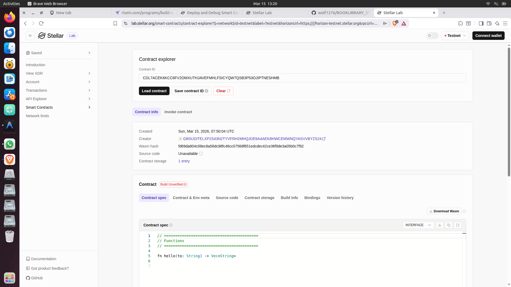

# BOOKLIBRARY Soroban Project



A decentralized book library management system built on the Stellar network using Soroban.
## Project Description
BOOKLIBRARY is a smart contract that allows for the decentralized management of a digital or physical book collection. It tracks book ownership, availability, and borrowing status on the blockchain, ensuring transparency and accountability in a library system.

## What it does
- **Registration**: Allows a library admin or the contract itself to register new books into the system.
- **Tracking**: Maintains a persistent record of all books, including their titles, authors, and current borrowing status.
- **Borrowing**: Enables users to borrow available books, marking them as unavailable in the system.
- **Returns**: Allows for the return of borrowed books, making them available for the next user.

## Features
- **Persistent Storage**: Book data is stored securely in the Stellar network's instance storage.
- **ID Generation**: Automatically increments and assigns unique IDs to new books.
- **Conflict Prevention**: Prevents double-borrowing of the same book.
- **Developer Friendly**: Includes a full suite of unit tests for verification.

## Project Structure
```text
.
├── contracts
│   ├── book-library
│   │   ├── src
│   │   │   ├── lib.rs
│   │   │   └── test.rs
│   │   └── Cargo.toml
│   └── hello-world
│       ├── src
│       │   ├── lib.rs
│       │   └── test.rs
│       └── Cargo.toml
├── Cargo.toml
└── README.md
```

## Deployed Smart Contract Link
 https://lab.stellar.org/r/testnet/contract/CBYNK3NUXBOEWLQQHACBMTH7JLHV4PSNJ22VPSHK77MCZZZZOSC3PBJM

## How to Run
### Test
```bash
cargo test -p book-library
```
### Build
```bash
soroban contract build
```